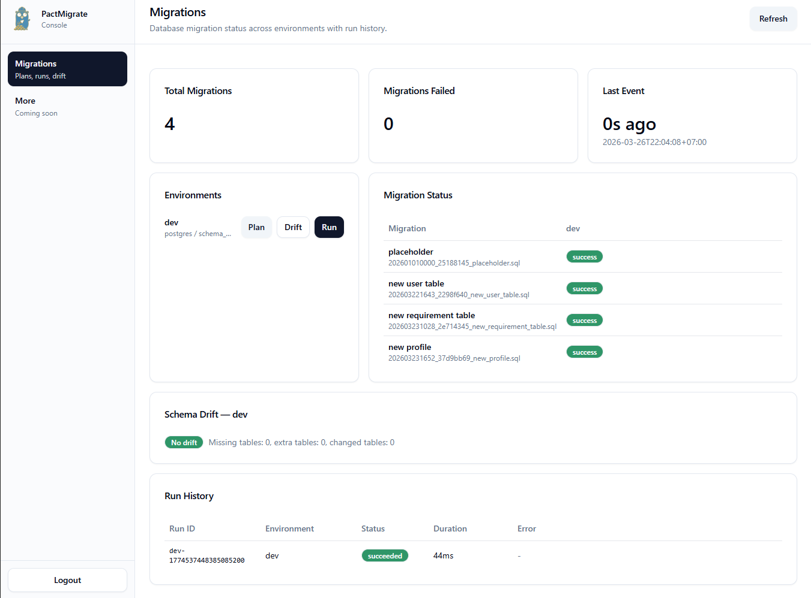
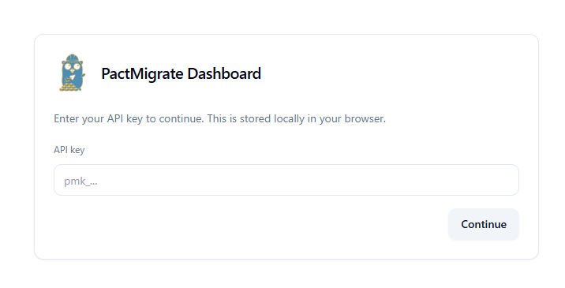

#  PactMigrate


<p align="center">
  
</p>

**PactMigrate** is an open-source **database schema migration** toolkit for **Postgres** and **MySQL**: a Go migration engine + CLI, with an optional API + dashboard for **plan/apply**, **audit history**, **schema drift detection**, and early **static seeder management**.

If you’re looking for a **Go migration tool** that supports **versioned SQL migrations**, predictable ordering, **advisory locking**, checksums, and CI-friendly workflows, PactMigrate is designed for that.

> This repository is a monorepo. Most users start with the CLI (`apps/pactmigrate-cli`) or the core Go package (`packages/core`).

## Features

- **Versioned SQL migrations**: `Timestamp_Hash_Title.sql` naming with deterministic ordering
- **Safe execution model**: plan/dry-run, apply, checksums, configurable out-of-order policy
- **Concurrency control**: advisory locking for Postgres/MySQL to prevent concurrent applies
- **Operational visibility**: optional API + dashboard with run history (audit table) and environment overview
- **Schema drift detection**: compares expected schema (from a scratch DB) vs live schema
- **Static seed inventory**: discover, validate, and inspect JSON seed files from the CLI, API, and dashboard
- **Required seed plan/apply**: schema-aware planning and idempotent upsert execution for file-backed required seeds
- **Seed run visibility**: separate seed execution history beside migration run history

## Dashboard preview

<p align="center">
  
</p>

## Login screen

<p align="center">
  
</p>

The dashboard currently authenticates using an API key that is defined in `apps/server/config.json`.

## Quickstart (CLI)

Build the CLI:

```bash
make build
```

Generate a config from the JSONC example:

```bash
make config
```

Plan (dry-run) and apply:

```bash
./migrate -config apps/pactmigrate-cli/config.json -plan
./migrate -config apps/pactmigrate-cli/config.json
```

List, plan, and apply required seeds:

```bash
./migrate -config apps/pactmigrate-cli/config.json -list-seeds
./migrate -config apps/pactmigrate-cli/config.json -plan-seeds
./migrate -config apps/pactmigrate-cli/config.json -apply-seeds
```

## Monorepo contents

- Core migration engine (`packages/core`) — parsing, planning, locking, and execution library
- CLI (`apps/pactmigrate-cli`) — binary with config, notifications, and migration execution
- API bridge (`apps/server`) — REST API wrapper for the dashboard + run auditing
- Dashboard app (`apps/dashboard`) — React web UI for migration visibility and run controls

## Monorepo layout

```
pact-migrate/
├── apps/
│   ├── dashboard/               # React dashboard (Vite + Tailwind)
│   │   ├── index.html
│   │   ├── package.json
│   │   ├── tailwind.config.ts
│   │   ├── vite.config.ts
│   │   ├── public/
│   │   │   └── PactMigrate-icon.png
│   │   └── src/
│   │       ├── App.tsx
│   │       ├── api/client.ts
│   │       ├── components/
│   │       │   ├── ErrorBoundary.tsx
│   │       │   └── ui/          # shadcn/ui-style components
│   │       ├── styles/
│   │       └── types.ts
│   ├── server/                  # Go API server
│   │   ├── main.go
│   │   ├── config.example.jsonc
│   │   └── internal/api/        # handlers + DB-backed run history
│   └── pactmigrate-cli/
│       ├── main.go
│       ├── embed.go
│       ├── google_chat_hook.go
│       ├── migrations/
│       ├── seeds/                # Phase 0 seeder assets and examples
│       ├── tools/jsonc2json/
│       ├── config.example.jsonc
│       ├── config.mysql.example.jsonc
│       └── config.json          # local only, gitignored
├── docs/
│   └── seeder-spec.md            # Phase 0 seeder contract
├── assets/
│   └── PactMigrate-icon.png
│   └── dashboard.png
│   └── login.png
├── packages/
│   ├── core/                    # migration engine library (loader, planner, locks, store)
│   └── protocol/                # shared cross-language contracts (placeholder)
├── internal/                    # private shared Go logic (placeholder)
├── go.work
├── Makefile
└── README.md
```

## Go workspace

This repo uses `go.work` to compose modules:

- `./packages/core`
- `./apps/pactmigrate-cli`
- `./apps/server`

Run commands from repo root.

## Core package

`packages/core` exposes the migration library:

- Hybrid file parsing (`Timestamp_Hash_Title.sql`)
- Loader from `fs.FS`
- Advisory locking (Postgres/MySQL)
- Transaction-wrapped migration execution
- State checksums
- Out-of-order policy
- Plan/dry-run API
- Lifecycle hooks

Import path:

```go
import pactmigrate "pactmigrate.local/packages/core"
```

## CLI (`pactmigrate-cli`)

`apps/pactmigrate-cli` runs migrations and supports:

- JSON config generated from JSONC examples
- File-system migration source (`apps/pactmigrate-cli/migrations`)
- File-system seed source (`apps/pactmigrate-cli/seeds`)
- `-plan` dry-run mode
- `-list-seeds` inventory mode
- `-plan-seeds` required seed planning
- `-apply-seeds` required seed execution
- Google Chat run-level cards (start + final status)

### Config generation

```bash
make config
make config-mysql
```

Defaults:

- JSONC input: `apps/pactmigrate-cli/config.example.jsonc`
- JSON output: `apps/pactmigrate-cli/config.json`

### Build and run

```bash
make build
./migrate
# or:
./migrate -config apps/pactmigrate-cli/config.json
./migrate -plan
```

## API bridge server

`apps/server` provides REST endpoints for the dashboard and wraps `packages/core`.

### Main endpoints

- `GET /api/v1/health`
- `GET /api/v1/environments`
- `GET /api/v1/dashboard`
- `GET /api/v1/seeds`
- `GET /api/v1/seeds/{seed_id}`
- `GET /api/v1/seed-runs?limit=20`
- `GET /api/v1/runs?limit=20`
- `POST /api/v1/environments/{name}/run` (JSON body: `{"mode":"plan"|"apply","plan_id":"..."}`)
- `POST /api/v1/environments/{name}/seeds/plan`
- `POST /api/v1/environments/{name}/seeds/apply`
- `GET /api/v1/drift/schema?env={name}`

### Server config

Create `apps/server/config.json` from `apps/server/config.example.jsonc`:

```bash
make config-server
```

### Build and run server

```bash
make build-server
./server -config apps/server/config.json
# or run directly:
make run-server
```

The dashboard can consume `GET /api/v1/dashboard` for summary cards + migration table, trigger migration runs through `POST /api/v1/environments/{name}/run`, inspect static seeds through `GET /api/v1/seeds`, and plan/apply required seeds per environment.

### Plan/apply workflow (policies)

If `policies.require_plan_before_apply` is enabled for an environment, clients must:

1) Plan:

```bash
curl -X POST localhost:8080/api/v1/environments/dev/run \
  -H 'Content-Type: application/json' \
  -d '{"mode":"plan"}'
```

2) Apply using the returned `plan_id`:

```bash
curl -X POST localhost:8080/api/v1/environments/dev/run \
  -H 'Content-Type: application/json' \
  -d '{"mode":"apply","plan_id":"<plan_id>"}'
```

### What “schema drift” means

Schema drift means: **the live database schema differs from the schema that your migration files would produce**.

This server implements drift checking using a **shadow (scratch) database**:

- **Expected schema**: the server applies the current migrations into the environment’s `scratch_dsn` and snapshots the resulting schema.
- **Actual schema**: the server snapshots the live DB schema from `dsn`.
- **Drift**: the diff between the two snapshots (missing/extra tables, missing/extra columns, and changed column signatures).

You can fetch it with:

```bash
curl "localhost:8080/api/v1/drift/schema?env=dev"
```

Current scope/limitations:

- Drift diff currently checks **tables + columns** (type/nullability/default) only.
- Postgres snapshots are limited to the **`public`** schema right now.
- The scratch DB is expected to be safe to mutate/reset; don’t point `scratch_dsn` at a real environment database.

#### Run history persistence (audit)

Run history is persisted in each configured environment database in the table `pactmigrate_run_history`. The endpoint `GET /api/v1/runs` reads from this table across all configured environments, and `GET /api/v1/seed-runs` filters the same audit store to seed executions.

## Seeder status

The repository currently includes the first implemented seed phases:

- Phase 0: seeder contract, config shape, and file layout
- Phase 1: read-only seed inventory in CLI, API, and dashboard
- Phase 2: required seed plan/apply with live schema validation
- Phase 2.5: seed run history and execution visibility

Current seed scope:

- static file-backed `required` seeds only
- JSON seed files only
- manual plan/apply only
- no delete reconciliation
- no dashboard editing yet

Seed files live under `apps/pactmigrate-cli/seeds/required/`.

## Dashboard app

Run the dashboard dev server:

```bash
make run-dashboard
```

## Migration file helpers

Create a new migration:

```bash
make migration name=add_users_table
```

Rehash migration filenames to content:

```bash
make migration-rehash
# or one file
make migration-rehash FILE=apps/pactmigrate-cli/migrations/202603221643_xxxxxxxx_name.sql
```
